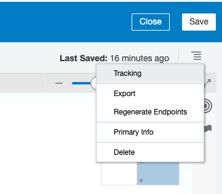

# Streaming data via OIC into BigQuery


## Introduction

Oracle Integration can abstract away complex authentication protocols for your app developers. Instead of having your develpers implement OAuth2 protocols in their applications to call the BigQuery API - OIC can take care of it and you can provide your develpers their OIC service account Basic Auth credentials and the endpoint. 

This is a continuation of [this lab.](https://github.com/GaryHostt/BigQueryIntegration/blob/master/README.md)
Click here to learn more about [Oracle Integration.](https://cloud.oracle.com/OIC)
Click here to learn more about [Streaming data into BigQuery.](https://cloud.google.com/bigquery/streaming-data-into-bigquery#bigquery_table_insert_rows-csharp)

## Objectives

•	Stream data into BigQuery via OIC

### Outline
1. Create an app driven integration
2. Configure a Python script to call the REST endpoint
3. Run the data loading script
5. Monitor the integration 

## Reference



This is also how your integration will look at the end of the walkthrough.

During the walkthrough, relevant instructions will be UNDER the picture they correlate with.

Below is the python script file we will be using, you will configure the authorization header and url to work with your OIC environment; it was inspired by [another workshop of mine.](https://github.com/GaryHostt/sampeIoTData)

```
import json
import random
import datetime
import time
import requests
from requests.exceptions import HTTPError
from datetime import datetime
import http.client
from random import randint, choice

#static values
WH_ID = ['WH1', 'WH2', 'WH3', 'WH4', 'WH5', 'WH6', 'WH7']
Item_name = ['Mechanically Separated', 'Shelf-Stable, Pathogen Negative Meat Slurry', 'Poultry Fat', 'Chicken Meal', 'Whole Ground']

def createJSON():
    data = {}
    data['WH_ID'] = random.choice(WH_ID)
    data['Item_Name'] = random.choice(Item_name)
    data['Item_id'] = random.randint(100, 110)
    data['Quantity_Available'] = random.randint(1000, 5000)
    data['Quantity_Requested'] = random.randint(1000, 5000)
    data['Backlog'] = random.randint(1000, 5000)
    return data
# Generate each parameter's data input in varying proportions
def submitData(data):
    headers = {
        'Content-Type': "application/json",
        'Content-Transfer-Encoding': "buffered",
        'Authorization': "FROM POSTMAN"
            }
    payload = data
    print(payload)  
    url='YOUR OIC URL'
    r = requests.request("POST", url, data=payload, headers=headers)
    print(r.status_code)
    response = requests.Session()
# Send payload to OIC

#Performs functions
while True:
    time.sleep(1)
    rnd = random.random()
    #$print(rnd)
    if (0 <= rnd < 0.99):
        data = json.dumps(createJSON())
        submitData(data)
        print('data submitted')
    elif (0.99<= rnd < 1):
        pass
```

# Walkthrough

## 1.	Create an app driven integration


Start by clicking create on the top right from the integration designer screen.


Select app-driven orchestration.

Name your integration and give it an apt description.

Configure a request payload for your rest endpoint and the relative URI.

Below is the request payload.
```
{"WH_ID":"","Item_Name":"","Item_id":2,"Quantity_Available":2,"Quantity_Requested":2,"Backlog":”"}

```


This is the response payload.
```
{"response":""}
```


After configuring your first REST endpoint, select your BigQuery REST connection from Part 1. 


Definte the relative resource URI to have your projectid, dataset, and table id. Configure a request payload for the endpoint. Here is the payload, the same from part 1. 
```
{
  "ignoreUnknownValues": true,
  "kind": "bigquery#tableDataInsertAllRequest",
  "rows": [
    {
      "insertId": "",
      "json": {"WH_ID":"27","Item_Name":"chickenstock","Item_id":"15","Quantity_Available":77,"Quantity_Requested":60,"Backlog":"-50"}
    }
  ],
  "skipInvalidRows": true,
  "templateSuffix": ""
}
```


Your payload should look like this for the request. 

Now open the mapper between your generic REST endpoint and the BigQuery connection.

Drag the fields from the left to the right to the rows. 


You will need to hardcode these per the request payload format, to do so simply click the field. 


This screen will pop-up, just type true in the box, then save & close. 


Your mapping should look like this by the end. 


Now open the mapper for your generic REST endpoint. 


Here we simply hardcode a 'Submitted' for the response. 


Add your tracking field. 


I selected WH_ID. 


Save and close the designer screen. Press the slider button to activate your integration. 


Activate and track your payloads (for the inevitable troubleshooting).


Click the arrow next to the green slider in order to get your endpoint url, it will be on the top of the new page. 

## 2. Configure a Python script to call the REST endpoint

We will now go to Postman to get the authentication header for our python script. If you go to the authorization tab, select Basic Auth, then type your OIC credentials. After that, press preveiw request.

Now click the header tab, here you can see the authentication header.


If you press the code button, Postman can actually generated code snippets for you that will call APIs, per your present configuration. 

Copy the url and Authorization information, the stuff marked out in read. And replace it in the python script at the beginning of this lab where it says "FROM_POSTMAN" & "YOUR OIC URL."
## 3. Run the data loading script

To run your python script, open the CLI, go to the directory with the script, and type 'python yourscriptname.py' this will run the script. 


The output in your terminal should look like this, if you do not get 200s, go to the OIC tracking page to begin troubleshooting.

## 4. Monitor the integration 


Returning to integration, we can see our data streaming now works. 


Back in BigQuery, we can see our uploaded data. 


