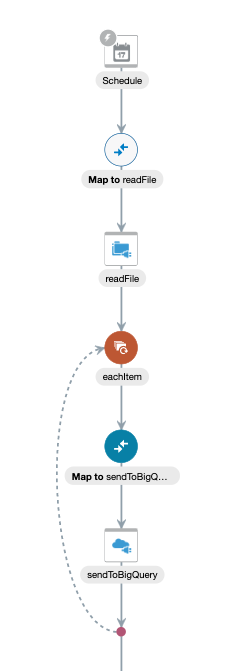

# Using Oracle Integration with Google BigQuery 

Oracle Cloud Infrastructure    |  Google Cloud Platform
:-----------------------------:|:-------------------------:
                |  

## Introduction

Users of the Google Cloud Platform are able to load data into BigQuery by [putting files in Cloud Storage and then loading the data from there.](https://cloud.google.com/bigquery/docs/loading-data-cloud-storage) You can also stream data into BigQuery with its API. This article will show how to use Oracle Integration to load data via the API. 

Click here to learn more about [creating integrations in OIC.](https://docs.oracle.com/en/cloud/paas/integration-cloud-service/icsug/create-integrations.html#GUID-F66ABE41-0A69-4A73-BC3D-0CE36FA78C4D)
Click here to learn more about [streaming data into BigQuery.](https://cloud.google.com/bigquery/streaming-data-into-bigquery#bigquery_table_insert_rows-csharp)

## Objectives

•	Load data from a csv file in a FTP server into BigQuery

### Outline
1. Create the BigQuery dataset and get credentials
2. Test data loading in Postman
3. Configure the Oracle Integration Connections
4. Create the integration 
5. Test & monitor the integration 

## Reference



This is also how your integration will look at the end of the walkthrough.

During the walkthrough, relevant instructions will be UNDER the picture they correlate with.

Below is the poultry.csv file we will be using, or you can download the file from this repo:

```
WH_ID,Item_Name,Item_id,Quantity_Available,Quantity_Requested,Backlog
WH8,Mechanically Separated,100,3365,3615,-250
WH5,"Shelf-Stable, Pathogen Negative Meat Slurry",104,8489,8085,0
WH5,Mechanically Separated,100,9213,9478,-265
WH7,Poultry Fat,105,1759,1992,-233
WH2,Chicken Meal,107,8575,9025,-450
WH4,Poultry By-Product Meal,103,3800,2839,0
WH3,Poultry By-Product Meal,103,6126,5951,0
WH7,Chicken By-Product Meal,102,5985,5245,0
WH3,Chicken Meal,107,6713,7169,-456
WH8,Poultry By-Product Meal,103,3718,3108,0
WH7,Chicken Meal,107,8922,9400,-478
```

# Walkthrough

## 1.	Create the BigQuery dataset and get your credentials


From your Google Cloud console, click the menu on the left and under Big Data, click BigQuery. 


Begin by creating a new dataset. 


Name your dataset, you can leave the settings. 


Now you can create the table where you will load the data.


Make sure your desired project and previously created dataset are selected, then add the fields. 


These are the fields. 


On the upper right of the screen, press the circled button and type this in your cloud shell: 

```
gcloud auth application-default print-access-token
```

Save this token for later, or you can always come back and get it again with the same method. [Source1.](https://cloud.google.com/sdk/gcloud/reference/auth/application-default/print-access-token) [Authentication Improvements.](https://stackoverflow.com/questions/47059976/get-service-account-auth-token-without-gcloud)

## 2.	Test data loading in Postman

We can now stream data into this table using Postman, here is [an example.](https://www.any-api.com/googleapis_com/bigquery/docs/tabledata/bigquery_tabledata_insertAll)


We can see from the POST url the necessary information we will need. I will assume you can find your projectId, above are screenshots of where to find your datasetId and tableId. 

Now in Postman, create a new tab and select the POST action. Then put in the url below with your information:
https://www.googleapis.com/bigquery/v2/projects/{projectId}/datasets/{datasetId}/tables/{tableId}/insertAll

Now click the authorization tab. 


Have 'Bearer token' as your type.
In the token box, copy and paste your token from your previous gcloud command. Note: if you ever get a 401 error, do the gcloud command again and get a new token. 
Then press Preview Request to add your token to your authorization header. 

For your body, use this sample JSON:

```
{
  "ignoreUnknownValues": true,
  "kind": "bigquery#tableDataInsertAllRequest",
  "rows": [
    {
      "insertId": "",
      "json": {"WH_ID":"27","Item_Name":"chickenstock","Item_id":"15","Quantity_Available":77,"Quantity_Requested":60,"Backlog":"-50"}
    }
  ],
  "skipInvalidRows": true,
  "templateSuffix": ""
}
```

Then press send you you should get back a 200 OK. Now that this works, we know the payloads, authentication, and REST url for streaming data to BigQuery. 

## 3.	Configure OIC connections


Fomr the OIC home page, press integrations on the left. 

Press connections on the left of the new menu. 

From the top right press create and then select the REST adapter. 

CORRECTION: [Input this base url](https://cloud.google.com/bigquery/docs/reference/rest/v2/tabledata/insertAll). We will put the rest of the URL in the orchestration. 

Scroll down to configure security, select API Key Based Authentication and paste your previously used, or a new token. 

Press test and save. 


Back on the connections screen, create a connection to your FTP server. Doing this depends on your FTP server, [click here for more info on using the FTP adapter.](https://docs.oracle.com/en/cloud/paas/integration-cloud-service/icsft/ftp-adapter-capabilities.html#GUID-59194DED-31DC-4E3D-893C-0064D7CC65A0). 

## 4. Create the integration

Press integrations on the left menu. Then press create on the upper right. 


Create a scheduled integration. 


Press the Plus sign below schedule and select your FTP connection. 

Name your endpoint. And then press Next. 


Specify the directory where your file resides on your FTP server. For the file name, name it poultry.csv. You need to include the file extension for this. Press next. 

On the schema, leave the radio button as yes for specifying the structure and leave the CSV. Press next. 


Upload your csv file. Name the Record item, the recordset as allItems. Change your fields to match the above fields in the screenshot to be the integer data type. You can leave the other default options.


Press the flag on the right and drag & drop a For Each item to be below your FTP action. 


For the repeating element, press the buttons circled then drag and drop item from the left to the reapeating element box on the right. Name the current element 'currentItem'. Press save the close. 


Now, just below your for each, press the plus sign and select your bigQuery connection. 


Name your endpoint, change the resource URI to match your details. Make sure you have slected POST & check mark the boxes. Press next. For the resource URI, you could actually enclose {tableid} and other parameters in brackets, and then dynamically pass those values. In the case where you need to send information to different tables, datasets, or projects in BigQuery.


Select JSON sample and then press inline. Paste this payload: 

```
{
  "ignoreUnknownValues" : true,
  "kind" : "bigquery#tableDataInsertAllRequest",
  "rows" : [ {
    "insertId" : "",
    "json" : {
      "WH_ID" : "25",
      "Item_Name" : "chickenstock",
      "Item_id" : "15",
      "Quantity_Available" : 77,
      "Quantity_Requested" : 60,
      "Backlog" : "-50"
    }
  } ],
  "skipInvalidRows" : true,
  "templateSuffix" : ""
}
```
Press ok to close this screen. Then press next. 


Back in the orchestration. Click the mapper and then the circled pencil. Drag and drop the fields from the left to the right. For the values in quotes, hard code those. 


Your mapper should look like this by the end. 


For hard coding, press the circled field. 


In the box below, put "true". This is how the other hardcoded values are done. Press save on the upper right and then close on the bottom right to close. 

To close the mapper, press validate then close on the upper right of the mapping screen. 


Drag and drop startTime from the left to the right. This value is how we will track each integration we run. Press save to close. Then press save and close on the upper right. 


Back on the main screen, press the slider button.


Check mark enable tracking and including the payload, this can help with troubleshooting, if necessary. Do not leave these checked for production envioronments. Then press activate - or schedule if so desired. 

Congrats! You have completed a scheduled integration that will read a .csv file from a FTP server. For each entry of that file, it will be uploaded as a row in your bigQuery table. 

## 5. Test & monitor the integration


To test your integration, press the hamburger menu on the right and press submit now. 


Click where the above screenshots are to get to tracking. You will see the time when you press submit now. 


Hopefully your integration is all green - you can see how many rows were uplaoded to BigQuery, in my case - 40. 


Back in BigQuery, we can now see our uploaded data in the preview section of our table! 

You can delete your data by running this SQL statement:
```
delete from DataLoad.OIC WHERE true;
```

## Conclusion

You have now created a REST endpoint that calls the BigQuery API. Next you can start applying further business logic, creating front ends, integrations with other systems, and much more!


There is however one problem with how this was implemented, our Auth token expires after a few minutes. There is a way [OIC can dynamically get the Auth token](https://docs.oracle.com/en/cloud/paas/integration-cloud/rest-api/Authorization_Types.html) so that this doesn't happen - instead having to go back and paste the new auth token in the BigQuery REST connection. Further configuration is needed - but this is the main idea on how to dynamically do OAuth 2.0 in OIC. [More information on Google Cloud Oauth2.](https://developers.google.com/identity/protocols/OAuth2ServiceAccount)

If desired, you could also start this off with a [REST endpoint](https://github.com/GaryHostt/ATPworkshop/blob/master/Lab200.md), or an [application trigger in order to stream data from events into your BigQuery data warehouse.](https://github.com/GaryHostt/OIC_SaaS_integration/blob/master/Lab200.md) You would simply start with an app driven orchestration instead of a scheduled orchestration. 

To continue to part 2, where we use Python to stream data real-time to BigQuery, [click here.](https://github.com/GaryHostt/BigQueryIntegration/blob/master/Part2.md)

Frenchtext, my projectid, originated from this [project.](https://github.com/GaryHostt/DailyNewsText)
